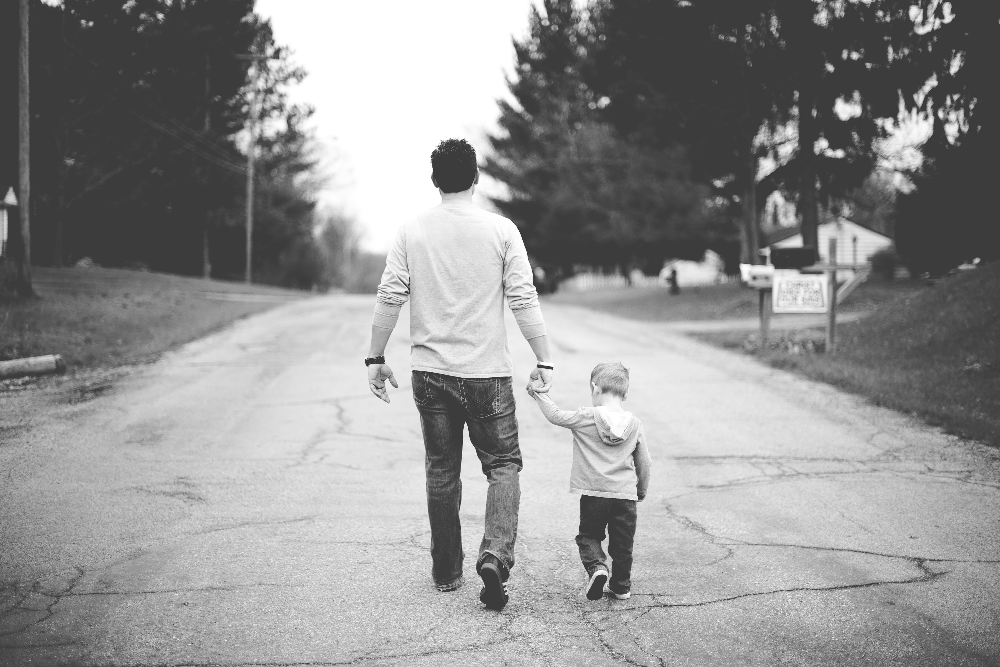

# Alpha Males don’t Exist (and other bullshit the culture wants you to believe)

Alpha males don’t exist. A quick search of Reddit will reveal people expressing their disdain for the concept of alpha males, often labelling the concept “cringy,” “immature,” or my favourite, “toxic.”

But I’m sure you’ve felt it. When that confident man walks into the room; you feel his presence. There is an aura to him. People are drawn to him, he takes up space, he lights up the room!

The problem is that the popular concept of an alpha male has largely become a parody. With internet celebrities flashing expensive lifestyles, young boys think this is what the alpha male is. It’s not. Finances can be part of being an alpha male, but true alphas are not defined by material possessions. True alphas know that material things come and go and therefore, we cannot let ourselves be defined by material things. We must be defined by something deeper. Something intangible. A certain “je ne sais quoi.”

## What is an Alpha Male?

### Generative

Alpha males are generative. In “King, Warrior, Magician, Lover” the author Robert Moore explains that the true masculine is generative. The image I like to think about is a strong father raising his daughter. He is nurturing, he is caring, he is protective, he is strong - this is the alpha male.

What is the opposite of generative? That’s right, degenerative or when referring to a person, _a degenerate_. When we take a closer look at this term we can see that all it means it to de-generate, i.e. to stop generation.

What is generation? Generation is having kids. Generation is creating. Generation is sowing your seeds and reaping the harvest.

So what is degeneration? The opposite. Not having kids. Wasting your potential.

The culture we live in can be labelled as degenerative simply for the fact that having kids and raising a family is now seen as counter-culture; what was once the norm is now the exception. This is how far we have fallen from rationality.

Men posing as alphas online will portray a life of sleeping with lots of women as something to attain to but this is not an alpha behaviour. Remember, alphas are _generative_ and this is _degenerative_ behaviour. Birth control, meaningless sex, not being a father. This is all beta behaviour.

I’m not saying not to have sex. I think we men must explore and have lots of sex so that we know what we like in a woman sexually. What I am saying is that it should not be the end goal. The end goal should be to find a high quality woman and make babies!

### Strong

Is being fat, out of shape, unable to do a pull up setting a good example for your children? No! Fuck no!

Alpha males are strong. In order to step into our alpha or our “King Energy” as Moore puts it, we must get strong. Therefore, getting stronger and doing hard shit is a must for men who want to become strong, valiant, brave leaders. Men who want to become good fathers must set good examples for their children.

We can cultivate the quality of strength in many ways. Physical, mental, emotional, strength is important in all of these errors. But it makes the most sense to start with the physical, here’s why.

By starting a regular exercise routine we learn how to create good habits and stick to them over a long period of time. To build a great body and get stronger, we have to being eating enough of the right food. This forces us to pay more attention to our diet, hopefully leading to use making better diet decisions. We also need to sleep to recover so instead of going out to the club on Friday, we may now opt to stay in and have a quiet night.

Once we begin to see our bodies improve our confidence will begin to sore - you feel good when you like what you see in the mirror.

Seeing that we can change our bodies, we begin to think about other areas of our lives that we can change. Can we learn a new skill set? Start a business? Find a new partner? The possibilities are endless.

### Intelligent

Men must lift, men must be strong, but don’t fall into the trap of being all brawn and no brains. You’ve got to train your mind just as hard as you train your body. You’ve got to acquire skills. You need to have great communication skills. You must project confidence. This is how you get others to trust you. This is how you find new work and business opportunities. This is how you banter and flirt. This is how you draw attention to yourself and advocate for your position in life.

Alpha males love learning as much as they love training. I encourage you guys to read as much as possible. It could be on anything. Fiction is good for expanding your vocabulary, cultivating your **lover energy**, understanding popular culture, and being able to say you’re “well read.”

Non-fiction is also great. I love reading self-improvement books. Authors like Robert Greene, Mark Manson, and Dr. Robert Glover all have valuable insights that can really make a difference in your life. Sometimes all it takes is one idea implemented in your life for you to see big changes.

You should also explore spiritual books. Books such as _The Power of Now_ by Eckhart Tolle, _The Alchemist_, and anything to do with subconscious programming or the law of attration i.e. _Think and Grow Rich_, anything by Dr. Joe Dispenza, etc.

Reading books from these three categories will make you a very interesting person. Women will find this very intriguing. You will be able to tap into circles that were previously closed to you. The goal should be to be able to talk to anyone about anything.

### Courageous

Alpha males are brave. When someone breaks into your house at 3 in the morning. Are you going to cower behind your wife, arguing with her about who will go see what’s happening? No! Women want a protector, they want a man with whom they can feel safe. This is why learning combat skills and testing your combat skills is important. Jiu jitsu is a great vehicle for this. Jiu jitsu incorporates live sparring, besides MMA, this is probably the closest you will get to a real life altercation. Competing takes this a step closer to reality.

### Abundant & Self-Assured

Alpha males are abundant. Think about it. Back in the cave man days, would the leader of the tribe be looking to others for approval and reassurance? No! Fuck no! That motherfucker would be confident and self-assured, perhaps even rubbing some people the wrong way - but guess what? He doesn’t give a fuck. Balance your not giving a fuck with a loving energy. How do we do this? By recognizing that the world is inherently abundant. By practicing faith. Realize there are tons of jobs out there. If someone else can get a job, why can’t you? Recognize that there are people not as smart as you, not as disciplined as you starting businesses everyday. Why not you? It’s simply a lack of belief in one’s self. We have self-limiting beliefs. We can begin to change this by exercising faith, cultivating a spiritual practice, having an attitude of gratitude, and looking up at the stars and realizing that there is something magical, vast, and inherently abundant about this universe. We are this universe and we are taken care of. Step into that energy.

### Loving

Alpha males are loving. In “King, Warrior, Magician, Lover” Moore describes how the King’s role is to order and balance all of the other energies within one’s psyche. If we have too much warrior energy for example, this can be bad for us. A man may become too detached, or too aggressive, unable to be tender and loving. A real alpha knows how to love his woman. Not fuck her while fantasizing in his head, no, he really makes love to her. I recommend reading about Robert Moore’s Lover archetype and reading up on Tantric Sex.

## Summary

I hope you found some value in this article. Alpha males _do_ exist but they may not be what or who you think they are.

Alpha males are not emotionless, aggressive, knuckle heads. No. Alpha males are strong, competent, emotionally intelligent leaders.

Step into your alpha, cultivate your King Energy, and go out there are conquer!

Some parting thoughts:

- Society doesn’t want you to be strong, independent, and free
- They want you weak, obedient and taking pills
- Alpha males are not the caricature you see online
- Yes, alpha males are strong and brave. But they are also nurturing, intelligent, wise, and loving.
- Alpha males do not fear failure
- They are constantly seeking growth
- They challenge themselves constantly
- And they are relaxed when others are tensed
  - Cool, calm, and collected
  - A real G
  - Don Corleone

[Joshua Jones](https://joshuajones.io)  
Grappling Philosopher
